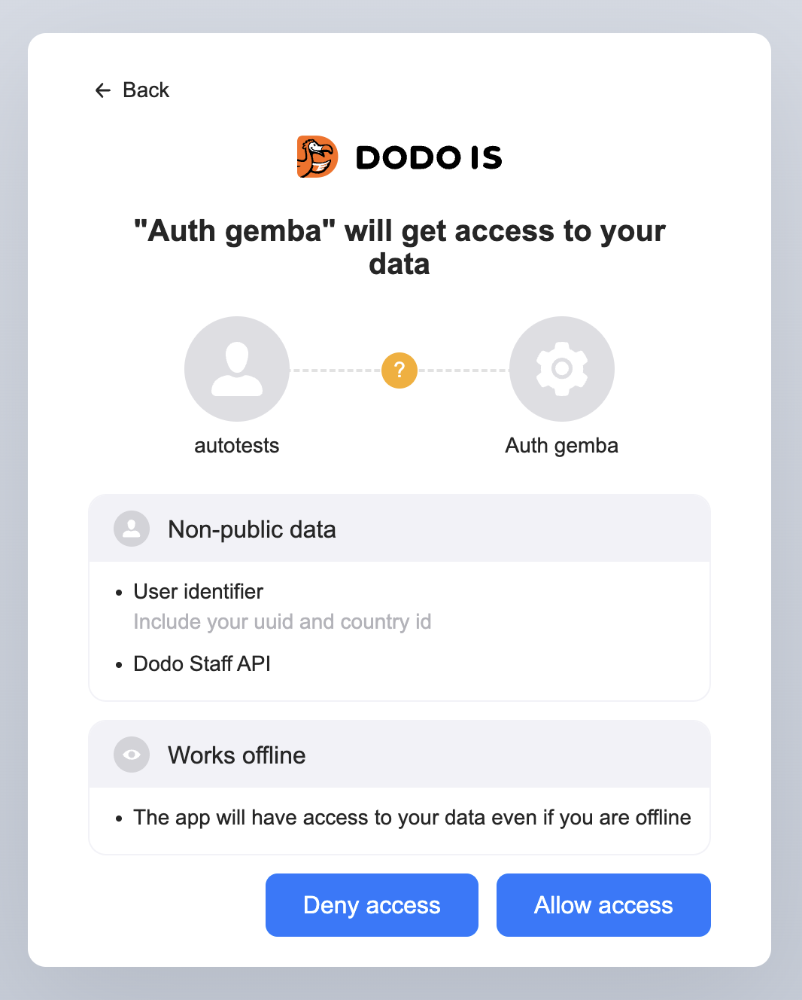

# Get your hands dirty and implement Authorization Code Workflow manually
This is `Elbow Grease` level version.
This sample code does not use any specific Oidc features of asp.net or external packages.
It is designed to be easily reproducible using any modern web development language and environment.
I'm trying not to use any asp.net-specific functions in the example app, so you can easily come up with the appropriate methods in your language and environment.
If you would like to see a working app using OAuth2.0 and OIDC authorization using a modern web application framework, check out 'Piece Of Cake` version of the sample code.

## What's in this example
This example is a web server that presents minimal UI necessary to trigger OIDC authorization code workflow, get access to the protected resources under your client credentials that you've received from
Please refer to Get Access To The API section in this docs:
https://docs.dodois.io/

## Prerequisites
For building the dotnet Auth samples you need dotnet 7.0.102.
You can download and install it here:
https://dotnet.microsoft.com/en-us/download/dotnet/7.0

## Configuration
For the example to work, you need to provide your credentials for acessing the API.
Take a look at the 
[appsettings.template.json](appsettings.template.json)
Please copy the contents of this file to appsettings.json in the same directory (this file does not exist as you've just checked out the sample).
Edit the [appsettings.json](appsettings.json), filling with the credentials and properties you've received.
Never commit this file to Git. This file is in the `.gitignore`. If you choose to place the credentials in a file stored in the same directory in your real application you should also make sure this file is not committed to the repository.

## Development HTTPS certificate
For development with OAuth you need HTTPS even if you work from localhost.

Use the following command to check if you already have a valid trusted HTTPS certificate:

```shell
dotnet dev-certs https --check --trust
A valid HTTPS certificate is already present.
```

In my case I already have one. If you receive input telling that there is not certificate or it is not trusted, run the following command:

In case something goes wrong with this part, refer to the documentation here:
Use the [dotnet dev-certs](https://learn.microsoft.com/en-us/dotnet/core/tools/dotnet-dev-certs) command to install and trust a valid self-signed development on your machine.

```sh
dotnet dev-certs https --trust
```

## Building

```shell
cd src
cd AuthExample.Console
dotnet run
```

Now open the url https://localhost:5999 in the browser, replacing 5999 with watever you've configured as myAppUri. The port should be the same as in the redirectUri you requested in the API credentials form.

You should be redirected to the signin page where you enter your user credentials.
After signing in, you should get a consent screen:


What is on the screen?

The consent screen includes information about the application and scopes of any non-public data you are giving consent for the app to access to.
In my case, it is `Auth gemba` app, which I am developing as I'm writing this code example. You will see your app name instead.
As for the scopes, I've requested `User identifier` and `Dodo Staff API` scopes, so I will be able to access user identifier and Dodo Staff API, which I will use for this code example later.

Also, you can see the `Works offline` item on the screen. It means I've requested a capability to get refresh tokens, so the app can refresh the access code without requiring the user to sign-in again after the initial code is expired.
